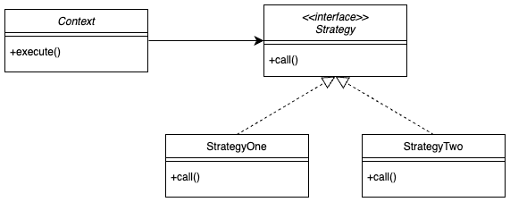

# 전략 패턴 (Strategy Pattern)

인터페이스를 정의하고, 각 행위을 클래스별로 캡슐화하여 특정 기능을 자유롭게 변경하여 사용하는 패턴이다. 객체의 행위를 동적으로 바꾸고 싶은 경우 직접 행위를 수정하지 않고 전략을 바꿔주기만 하며 유연하게 확장하는 방법으로 정책 패턴(Policy Pattern)이라고도 한다.

> 전략 패턴(Strategy Pattern) 또는 정책 패턴(Policy Pattern)은 실행 중에 알고리즘을 선택할 수 있게 하는 행위 소프트웨어 디자인 패턴이다. 전략 패턴은 특정한 계열의 알고리즘을 정의하고, 각 알고리즘을 캡슐화하며, 이 알고리즘들을 해당 계열 안에서 상호 교체가 가능하게 만든다. 위키피디아
>


### Strategy.java

```java
public interface Strategy {

    public void run();
}
```

### StrategyOne.java

```java
public class StrategyOne implements Strategy {

    @Override
    public void run(){
        System.out.println("Strategy One 실행");
    }
}
```

### StratgyTwo.java

```java
public class StrategyTwo implements Strategy {

    @Override
    public void run(){
        System.out.println("Strategy Two 실행");
    }
}
```

### Strategist.java

```java
public class Context {

    void execute(Strategy strategy){
        strategy.run();
    }
}
```

### StrategyMain.java

```java
public clsss StrategyMain {

    public static void main(String[] args) {

        Strategy strategy1 = new StrategyOne();
        Context context1 = new Context(strategy1);
        context1.execute();

        Strategy strategy2 = new StrategyTwo();
        Context context2 = new Context(strategy2);
        context2.execute();
    }
}
```

## 참고

- 템플릿 메서드 패턴은 부모 클래스에 변하지 않는 템플릿을 두고, 변하는 부분을 자식 클래스에 두어 상속을 통해 문제를 해결했다. 하지만, 전략 패턴은 변하지 않는 부분을 Context에 두고, 변하는 부분을 Strategy라는 인터페이스의 구현체에 두어 상속이 아니라 위임으로 문제를 해결한다.
- 스프링 애플리케이션을 개발할 때 애플리케이션 로딩 시점에 의존관계 주입을 통해 필요한 의존관계를 모두 맺은 후 실제 요청을 처리하는 원리와 같다.