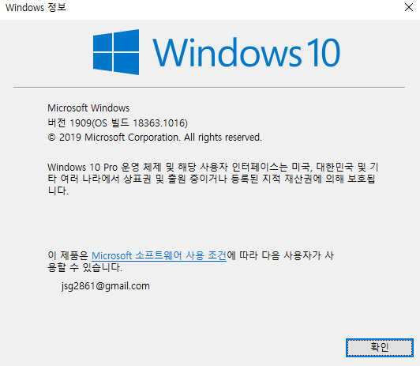

## WSL2 (Window Subsystem for Linux 2)

윈도우에서 경량 가상화 기술을 사용해 리눅스를 구동할 수 있도록 도와주는 기능이다.

WSL2는 WSL를 개선해 더 뛰어난 성능과 환경을 이용할 수 있다.

> 참고 : https://psychoria.tistory.com/734

### 1. 버전 확인

- 명령 프롬프트 창
  - 버전 : 1903 이상
  - OS 빌드 : 18362 이상

```shell
winver
```



### 2. WSL 기능 활성화

- 관리자 권한으로 Power Shell 실행

```shell
dism.exe /online /enable-feature /featurename:Microsoft-Windows-Subsystem-Linux /all /norestart
```

### 3. Virtual Machine Platform 활성화

```shell
dism.exe /online /enable-feature /featurename:VirtualMachinePlatform /all /norestart
```

- Virtual Machine Platform 활성화 후 컴퓨터 재부팅

### 4. Ubuntu 다운로드

- Microsoft Store에서 Ubuntu 검색 후 다운로드 및 실행


```shell
> exit
```

### 5. WSL 2 업데이트 

**https://docs.microsoft.com/en-us/windows/wsl/wsl2-kernel** 에서 다운로드

### 6. WSL 2를 기본으로 설정

```sehll
wsl --set-default-version 2
```

- 잘못된 명령어 줄입니다가 발생하면 wsl --help를 입력하여 --set--default-version이 나열되지 않으면 OS에서 해당 기능을 지원하지 않으며 버전 1903, 빌드 18362 이상으로 업데이트를 해야 한다.
  - https://www.microsoft.com/ko-kr/software-download/windows10

### 7. WSL 2로 전환

```shell
wsl -l -v
```

```shell
wsl --set-version ubuntu 2
```

