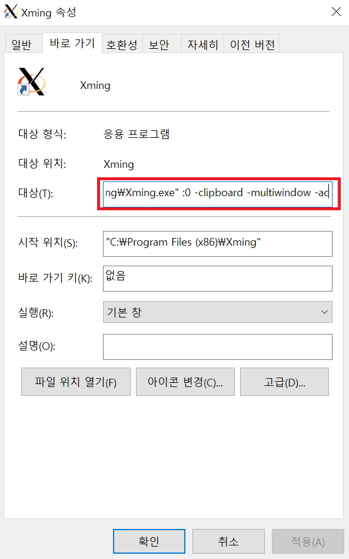

## X Server

> 참고 : https://evandde.github.io/post/200228-wsl-xwindow/ 를 참고 했습니다.

- Xming 다운로드
  - http://straightrunning.com/XmingNotes/

### 1. WSL과 Xming 연동

#### 1.1 WSL1

WSL1은 Windows와 IP 주소가 동일하기 때문에 클라이언트에서 X window 요청이 들어오면, localhost인 Windows용 X server에 던져주면 된다.

##### 1.1.1 환경 변수 설정

```shell
vi ~/.bashrc
```

```shell
...
...

export DISPLAY=localhost:0
```

#### 1.2 WSL2

WSL2는 Windows 내에서 별도의 WSL2용 네트워크를 사용하기 때문에 설정이 필요함

1. WSL2에서 Windows의 주소를 흭득 후 DISPLAY 환경 변수로 지정
2. Windows에서 실행한 X server 프로그램에서 외부 IP로 부터 들어오는 요청을 허용하도록 설정
3. Windows 방화벽에서 WSL2의 요청을 허용

##### 1.2.1 DISPLAY 환경 변수 설정

```shell
cat /etc/resolv.conf
```

```shell
# 결과
...
...
nameserver 203.~.~.~
```

```shell
vi ~/.bashrc
```

```shell
...
...
...

export DISPLAY="`grep nameserver /etc/resolv.conf | sed 's/nameserver //'`:0"
```

##### 1.2.2 Xming 외부 IP 요청 허용

Xming은 기본적으로 localhost으로부터 들어오는 요청만 허용한다. 외부 IP로부터의 요청도 허용하도록 설정한다. Xming 속성에 -ac 옵션을 추가하면 된다.

1. Xming 우클릭 - 속성 - 대상에 -ac 추가



##### 1.2.3 방화벽 설정

- power shell을 실행하여 다음명령어를 입력

```shell
New-NetFirewallRule -DisplayName "WSL" -Direction Inbound -LocalAddress $myIp -Action Allow
```

### 2. FireFox 다운로드

- Ubuntu 에서 다음 명령어 입력

```shell
sudo apt-get install firefox
```

```shell
# firefox 실행
firefox
```

