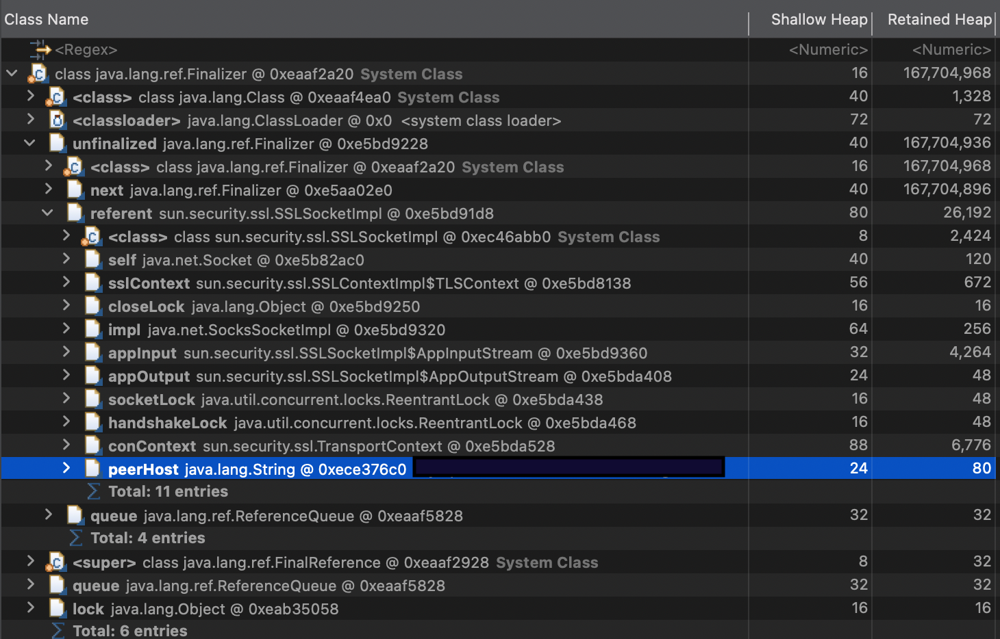

## HeapDump 분석

MAT(Memory Analyzer Tool)으로 메모리 분석



DB에 연결할 때 SSLSocketImpl에서 메모리 누수가 발생하는 것을 확인

### MasterDB의 SSL 설정 정보 확인

```
show status like '%ssl%';
```


MasterDB 상태에서 ssl 암호화와 버전이 설정 되어 있지 않은 것을 확인 할 수 있음

Java에서 MySQL에 연결 할 때 디폴트 값으로 SSL을 사용하는 데 usessl=false로 설정하여 ssl을 사용하지 않으며 메모리 누수를 해결