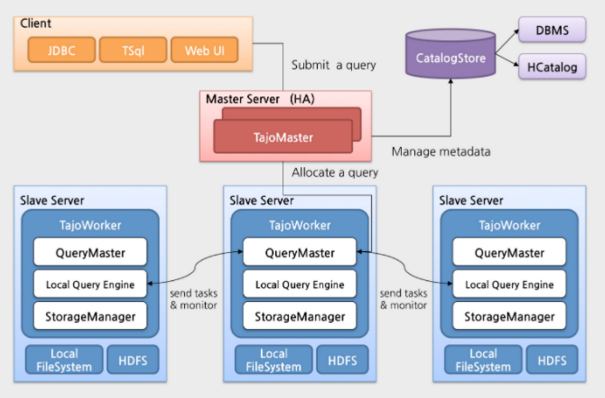
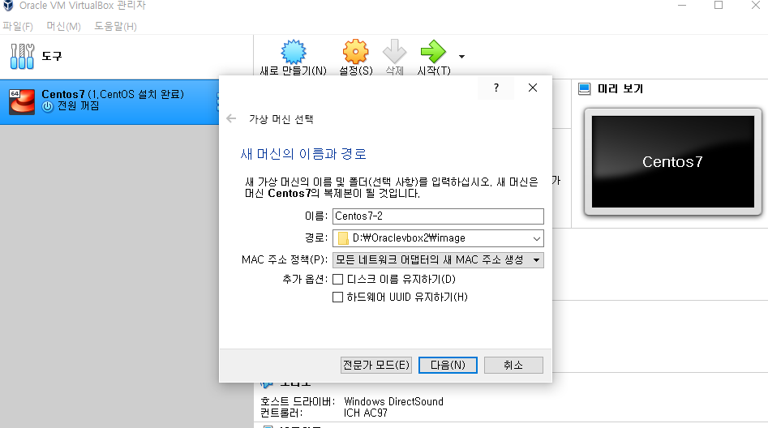
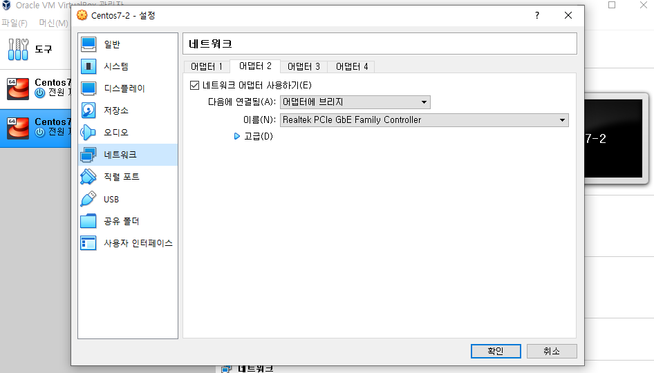
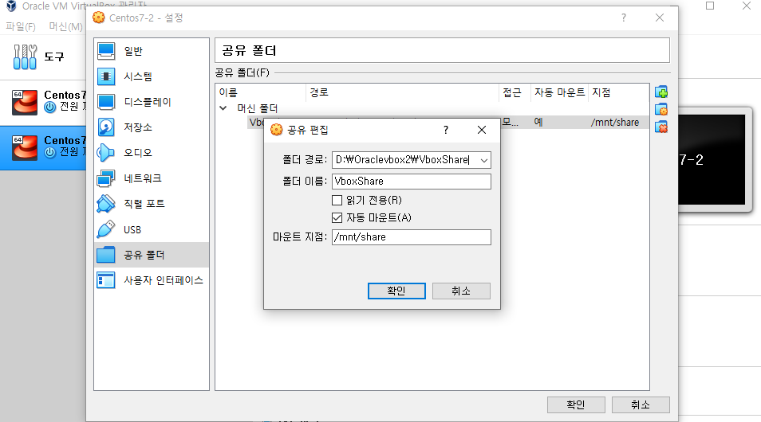

## Tajo

- SQL-on-Hadoop
- HDFS에 저장된 데이터를 SQL 쿼리로 처리할 수 있게 해주는 시스템

- 하둡 기반의 대용량 Data Warehouse 시스템

### 특징

- 완전한 SQL 표준을 지원
- Master/Slave 구조를 가짐
- 성능 향상을 위해 질의 전체를 분산 처리함
- HDFS를 기본 저장소 사용하기 때문에 결과가 HDFS에 저장
- 최초 관계형 모델을 사용하였으나 현재는 nested모델도 지원
- ETL 작업(Long Time Query)뿐만 아니라 Low Latency(빠른 응답을 요구하는 Ad-ho Query) 질의도 지원
- 사용자가 직접 함수를 정의할 수 있음
- 다양한 최적화를 위해 Cost-based optimization 모델과 확장 가능한 Rewrite Rule을 제공

### Tajo 아키텍처



- 클라이언트
  - 타조는 다양한 채널을 통해 질의를 수행
  - JDBC 드라이버, TSQL 쉘, 웹 인터페이스
- 타조 마스터
  - 타조 클러스터의 마스터 역할을 수행
  - 테이블 생성 및 삭제 등 분산 처리 없이 가능한 질의를 실행
  - 클라이언트 API를 RPC로 제공
  - Query Parser, Query Planner 제공
  - 질의 실행 계획 최적화
  - 쿼리마스터 관리, 질의 실행 요청이 들어오면 유효한 타조 워커 중 하나를 쿼리마스터로 선정
  - 테이블 정보 및 각종 통계 정보와 같은 메타데이터를 관리하는 카탈로그 서버를 내장(별도 구축 가능)
  - 전체 클러스터의 자원을 관리
- 타조 워크
  - 쿼리마스터
    - 타조 마스터가 생성한 논리 실행 계획을 분산 실행 계획으로 변환, 타조 클러스터의 다른 타조 워커들을에게 질의 실행을 요청, 실행 중인 질의를 모니터링
  - 로컬 질의 실행
    - 로컬 질의 실행 엔진은 쿼리마스터의 질의 실행 요청을 처리, 이 엔진에는 스토리지 매니저가 내장되어 있어서 HDFS, S3, 로컬 파일 시스템과 같은 다양한 스토리 지에 접근할 수 있음


### 네트워크 구성

1. centos 복제





2. centos7 설정

   - 시스템 - 기본메모리 : 4096
   - 네트워크 - 다음에 연결됨 : 어댑터에 브리지

3. centos7-2 설정

   - 시스템 - 기본메모리 : 4096
   - 네트워크 - 
     - 어텝터 1 : 네트워크 어댑터 사용하기 x 
     - 어뎁터 2 : 네트워크 어댑터 사용하기 - 다음에 연결됨 : 어댑터에 브리지

   

   - 공유 폴더 - 편집 : Oraclevox2/VobxShare로 변경




4. hadoop 노드 ip 변경

```shell
vi /etc/hosts
```

```shell
127.0.0.1   localhost localhost.localdomain localhost4 localhost4.localdomain4
::1         localhost localhost.localdomain localhost6 localhost6.localdomain6
192.168.1.52 hadoopnode01
#10.0.2.15   hadoopnode02
#10.0.2.15   hadoopnode03
#10.0.2.15   hadoopnode04
```

5. Centos7-2 hadoop 노드 ip 변경

```shell
vi /etc/hosts
```

```shell
127.0.0.1   localhost localhost.localdomain localhost4 localhost4.localdomain4
::1         localhost localhost.localdomain localhost6 localhost6.localdomain6
192.168.1.64 workernode
#10.0.2.15   hadoopnode02
#10.0.2.15   hadoopnode03
#10.0.2.15   hadoopnode04
```

6. key 등록

```shell
cd
cat .ssh/id_rsa.pub >> .ssh/authorized_keys
```

7. 호스트 설정
   1. centos7-1에 centos7-2 등록
   2. centos7-2에 centos7-1 등록


- centos7-1 에서

``` 
vi /etc/hosts
```

```shell
127.0.0.1   localhost localhost.localdomain localhost4 localhost4.localdomain4
::1         localhost localhost.localdomain localhost6 localhost6.localdomain6
192.168.1.64 workdernode
192.168.1.52 hadoopnode01
#10.0.2.15   hadoopnode02
#10.0.2.15   hadoopnode03
#10.0.2.15   hadoopnode04
```

- centos7-2 에서

```shell
vi /etc/hosts
```

```shell
127.0.0.1   localhost localhost.localdomain localhost4 localhost4.localdomain4
::1         localhost localhost.localdomain localhost6 localhost6.localdomain6
192.168.1.64 workdernode
192.168.1.52 hadoopnode01
#10.0.2.15   hadoopnode02
#10.0.2.15   hadoopnode03
#10.0.2.15   hadoopnode04
```


### 타조 설치

> http://apache.org/dyn/closer.cgi/tajo/tajo-0.11.3/tajo-0.11.3.tar.gz

Tajo 0.11.3은 hadoop 3.0대랑 호환이 되지 않음

```shell
wget http://apache.org/dyn/closer.cgi/tajo/tajo-0.11.3/tajo-0.11.3.tar.gz

```

### 1.타조 마스터 환경 설정(CentOS7)

#### 1.1 TAJO_HOME 설정

```shell
vi .bashrc
```

```shell
...
...
export TAJO_HOME=/home/bit44/tajo-0.11.3
...
...
```

```shell
source .bashrc
```

#### 1.2 tajo-env.sh 설정

```shell
cd tajo-0.11.3
vi conf/tajo-env.sh
```

```sh
...
...

# Hadoop home. Required
export HADOOP_HOME=$HADOOP_HOME

# The java implementation to use.  Required.
export JAVA_HOME=$JAVA_HOME

# Extra Java CLASSPATH elements.  Optional.
export TAJO_CLASSPATH=$TAJO_HOME:$TAJO_HOME/lib

...
...

# Where log files are stored.  $TAJO_HOME/logs by default.
export TAJO_LOG_DIR=${TAJO_HOME}/logs

# The directory where pid files are stored. /tmp by default.
export TAJO_PID_DIR=$TAJO_HOME/pids

...
...
```

#### 1.5 Woker 등록

```shell
vi conf/workers
```

```shell
workernode
```

#### 1.4 tajo-site.xml 설정

```shell
cp conf/tajo-site.xml.template conf/tajo-site.xml
vi conf/tajo-site.xml
```

rootdir : 타조에서 이정보를 통해서 hdfs에 접근

tajo.worker.tmpdir.locations : 타조 워커가 사용할 임시 폴더

tajo.worker.resource.dfs-dir-aware : 하둡의 hdfs-site.xml의 설정 파일을 사용하여 타조 워커가 쓸 디스크로 불러 사용하라는 뜻

```xml
<property>
  <name>tajo.rootdir</name>
  <value>hdfs://hadoopnode01:9000/tajo</value> 
  <description>Base directory including system directories.</description>
</property>

<property>
  <name>tajo.master.umbilical-rpc.address</name>
  <value>hadoopnode01:26001</value>
  <description>TajoMaster binding address between master and workers.</description>
</property>

<property>
  <name>tajo.master.client-rpc.address</name>
  <value>hadoopnode01:26002</value>
  <description>TajoMaster binding address between master and clients.</description>
</property>

<property>
  <name>tajo.resource-tracker.rpc.address</name>
  <value>hadoopnode01:26003</value>
  <description>TajoMaster binding address between master and workers.</description>
</property>

<property>
  <name>tajo.catalog.client-rpc.address</name>
  <value>hadoopnode01:26005</value>
  <description>CatalogServer binding address between catalog server and workers.</description>
</property>


...
...
...

<property>
  <name>tajo.worker.tmpdir.locations</name>
  <value>/home/bit44/tajo-0.11.3/tmp</value>
  <description>A base for other temporary directories.</description>
</property>
<property>
  <name>tajo.worker.resource.dfs-dir-aware</name>
  <value>true</value>
</property>
```

```shell
mkdir tmp
```

#### 1.5 카탈로그 서버 설정

- 메타정보를 관리는 서버가 카탈로그 서버인데 그 서버로 mysql로 사용

- tajo_db 생성 & tajo 유저 생성 & 비밀번호 '1234'를 쓰기 위한 작업

```shell
mysql -u root -p
> create database tajo_db default character set UTF8;
> set GLOBAL validate_password.length=4;
> set GLOBAL validate_password.mixed_case_count=0;
> set GLOBAL validate_password.policy=LOW;
> set GLOBAL validate_password.special_char_count=0;
> create user 'tajo'@'%' identified by '1234';
> grant all privileges on tajo_db.* to tajo@'%';
> flush privileges;
> quit
```

- catalog-site.xml 수정

```mysql
 cp conf/catalog-site.xml.template conf/catalog-site.xml
 vi conf/catalog-site.xml
```

```xml
<!-- Please remove comments if you want JDBC-based catalog store. -->
<property>
  <name>tajo.catalog.connection.id</name>
  <value>tajo</value>
</property>
<property>
  <name>tajo.catalog.connection.password</name>
  <value>1234</value>
</property>

<!-- JDBC Store Section -->

<!-- Please remove comments corresponding to your desired catalog store. -->
<!-- You must choose only one catalog store driver among them. -->

 <!-- MySQL Catalog Store Driver -->
 <property>
  <name>tajo.catalog.store.class</name>
  <value>org.apache.tajo.catalog.store.MySQLStore</value>
 </property>
 <property>
  <name>tajo.catalog.jdbc.uri</name>
  <value>jdbc:mysql://hadoopnode01:3306/tajo_db?rewriteBatchedStatements=true</value>
 </property>

...
...
```

```shell
vi conf/wokers
```

```shell
workernode
```

```shell
cp ../apache-hive-2.3.7-bin/lib/mysql-connector-java-8.0.21.jar lib/
```

### 2. 타조 워커 환경 설정(Centos7-2)

```shell
vi .bashrc
```

```shell
...
...
export TAJO_HOME=/home/bit44/tajo-0.11.3
...
...
```

```shell
source .bashrc
```

#### 2.1 타조 마스터에서 타조 폴더 복사(centos7)

```shell
scp -r /home/bit44/tajo-0.11.3 workernode:/home/bit44/
```

### 3. 타조 실행

```shell
bin/start-tajo
```

#### 3.1 실행 확인

- Master(CentOS7) 에서

```shell
jps
```

```shell
...
...
7730 TajoMaster
...
```

- Slave(CentOS7-2) 에서

```shell
jps
```

```shell
6037 Jps
5951 TajoWorker
```

#### 3.2 예제

- Master(CentOS7)에서

```shell
cd
cd tajo-0.11.3
mkdir work
vi work/data.csv
```

```csv
1|abc|1.1|a
2|def|2.3|b
3|ghi|3.4|c
4|jkl|4.5|d
5|mno|5.6|e
```

```shell
bin/tsql
```

- Tajo에서 \dfs를 사용하여 hdfs 명령어를 사용할 수 있음

```tqsl
> \dfs -ls /
> \dfs -mkdir /tajo/warehouse/table1
> \dfs -put work/data.csv /tajo/warehouse/table1
> create external table table1 (id int, name text, score float, tpye text) using TEXT with ('text.delimiter'='|') location '/tajo/warehouse/table1';
> \d table1;
> select * from table1;
```


-----------------

ETL (Extract Transform Load) 작업: 데이터를 추출해서 가공하여 결과를 저장하는 작업