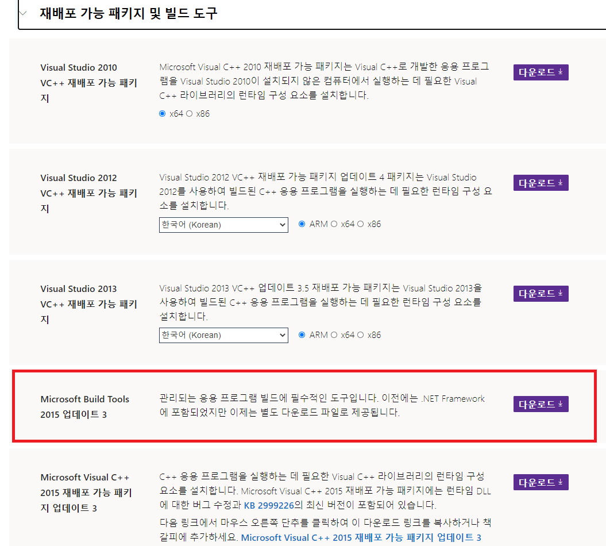

## PyHive 설치

- [Hadoop 설치](https://github.com/jeonsanggi/TIL/blob/master/Hadoop/04.Hadoop-%EC%84%A4%EC%B9%98.md)와 [hive 설치](https://github.com/jeonsanggi/TIL/blob/master/Hadoop/10.HIVE.md) 가 되어 있어야 합니다.

### 1. Window에서 Pyhive 설치

```shell
pip install pyhive
pip install thrift
pip install thrift-sasl
pip install sasl
```

#### 1.1 sasl 설치 에러 발생

##### 1.1.1 Visual C++ Build Tools ERROR

- https://visualstudio.microsoft.com/ko/vs/older-downloads/ 에서 패키지 및 빌드 도구 다운로드
  - Microsoft Build Tools 2015 업데이트 3 설치
  
- 

##### 1.1.2 'sasl/sasl.h': No such file or directory ERROR

- https://www.lfd.uci.edu/~gohlke/pythonlibs/#sasl 에서 sasl‑0.2.1‑cp37‑cp37m‑win_amd64.whl 다운로드

- 다운로드 받은 파일을 C:\Users\사용자명으로 붙여넣기
  - e.g. C:\Users\BIT\
- pip install sasl‑0.2.1‑cp37‑cp37m‑win_amd64.whl

```
pip install sasl‑0.2.1‑cp37‑cp37m‑win_amd64.whl
```

- 참고 사이트 : https://stackoverflow.com/questions/26505882/unable-to-install-sasl-0-1-3-python-package-on-windows-machine/35985464

### 2. Linux에서 Hadoop 설정

#### 2.1 hadoop core-site.xml 설정

- hadoop.proxyuser.username(리눅스 계정명).hosts  추가
- hadoop.proxyuser.username(리눅스 계정명).groups 추가

```shell
cd ~/hadoop
vi etc/hadoop/core-site.xml
```

```xml
<!-- core-site.xml -->
<property>
<name>hadoop.proxyuser.username(리눅스 계정명).hosts</name>
<value>*</value>
</property>

<property>
  <name>hadoop.proxyuser.username(리눅스 계정명).groups</name>
  <value>*</value>
</property>
```

- 참고 사이트: https://stackoverflow.com/questions/40603714/hive-is-not-allowed-to-impersonate-hive

#### 2.2 포트 열기

```shell
sudo firewall-cmd --permanent --zone=public --add-port=10000/tcp
reboot
```

### 3. 테스트

#### 3.1 하둡 실행 (Linux)

```shell
cd ~/hadoop
sbin/start-dfs.sh 
sbin/start-yarn.sh 
sbin/yarn-daemon.sh start proxyserver
sbin/mr-jobhistory-daemon.sh start historyserver
```

#### 3.2 하이브 서버 실행 (Linux)

```shell
cd ~/apache-hive-2.3.7-bin/
bin/hiveserver2
```

#### 3.3 pyhive 실행

- host: host ip (리눅스 ip)
- port: hive port
- username: 사용자명 (리눅스 사용자명)
- password: 사용자 비밀번호 (리눅스 계정 비밀번호)

```python
from pyhive import hive
conn = hive.Connection(host="192.168.1.58", port=10000, username='bit44', password='1234', auth='CUSTOM')
cursor = conn.cursor()
cursor.execute("SHOW TABLES")
for table in cursor.fetchall():
    print(table)
```

##### 3.3.1 SASL ERROR 발생 시

```shell
Could not start SASL: b'Error in sasl_client_start (-4) SASL(-4): no mechanism available: Unable to find a callback: 2'
```

- C:\CMU\bin\ 에 sasl2 폴더 복사
  1. C: 에 CMU\bin 폴더 생성
  2. C:\Users\사용자명\anaconda3\envs\가상환경명\Library\bin 에 있는 sasl2 폴더 복사 후 C:\CMU\bin\에 붙여넣기 

- 참고 사이트 : https://github.com/dropbox/PyHive/issues/161#issuecomment-626506079

##### 3.3.2 connect ERROR 발생 시

아래와 같은 에러가 발생하면 ip주소와 port를 확인 후 Linux에서 port 열어 주기

```shell
TTransportException: Could not connect to any of [('192.168.1.58', 10000)]
```

