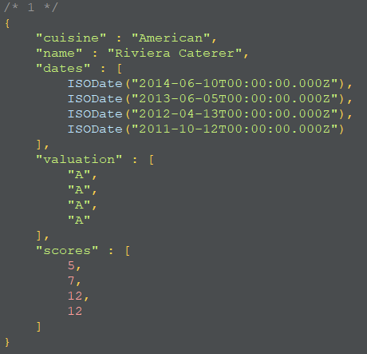
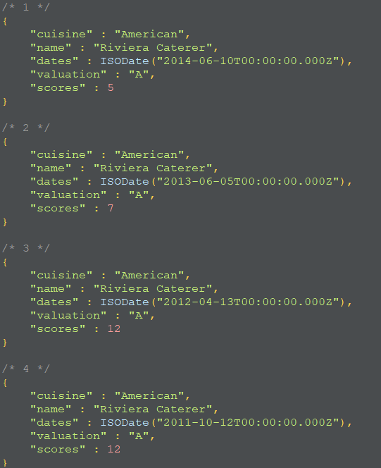

## MongoDB Aggreation

[TOC]

- MongoDB는 Aggreation 프레임워크를 제공
- 한 개 이상의 Pipeline으로 구성됨

### 1. Count

```javascript
db.restaurants.count()
```

### 2. Match

- 조건에 맞는 Document 모두 출력

```javascript
db.restaurants.aggregate([{$match: {cuisine: "Hamburgers"}},])
```

### 3. Project

- 출력할 필드를 선택

```javascript
db.restaurants.aggregate([{$match: {cuisine: "Hamburgers"}},
{$project :{
    _id:0,
    cuisine:1,
    borough:1,
    name:1
    }}
])
```

### 4. limit

```javascript
db.restaurants.aggregate([{$match: {cuisine: "Hamburgers"}},
                          {$limit:10},
                          {$project :{ 
                              _id:0,
                              cuisine:1,
                              borough:1,
                              name:1
                          }}
                         ])
```

### 5. sort

```javascript
db.restaurants.aggregate([{$match: {cuisine: "Hamburgers"}},
                          {$sort: {name: 1}},
                          {$limit:10},
                          {$project :{ 
                              _id:0,
                              cuisine:1,
                              borough:1,
                              name:1
                          }}
                         ])
```

### 6. skip

```javascript
db.restaurants.aggregate([{$match: {cuisine: "Hamburgers"}},
                          {$sort: {name: 1}},
                          {$skip: 10},
                          {$limit:10},
                          {$project :{ 
                              _id:0,
                              cuisine:1,
                              borough:1,
                              name:1
                          }}
                         ])
```

### 7. Alias

```javascript
db.restaurants.aggregate([
    {$match:{"address.street" : "Stillwell Avenue"}},
    {$project:{
        _id: 0,
        cuisine :1,
        name: 1,
        dates: "$grades.date",
        valuation : "$grades.grade",
        scores : "$grades.score"}}
])
```

- 실행 후



### 8. unwind

- 하나의 Document를 배열의 개수 만큼의 Document로 나눠줌

```javascript
db.restaurants.aggregate([
    {$match:{"address.street" : "Stillwell Avenue"}},
    {$unwind: "$grades"},
    {$project:{
        _id: 0,
        cuisine :1,
        name: 1,
        dates: "$grades.date",
        valuation : "$grades.grade",
        scores : "$grades.score"}}
])
```

- 실행 후



### 9. filter

- 조건에 맞지 않으면 빈 배열을 반환

```javascript
db.restaurants.aggregate([
    {$match: {"cuisine":"Italian", "borough" : "Brooklyn"}},
    {$project :{
        _id: 0,
        cuisine : 1,
        name: 1,
        praise : {
            $filter: {
                input: "$grades",
                as : "good",
                cond : {$gte : ["$$good.score", 20]}
            }
        }
    }},
])
```

- 조건에 맞지 않은 것들을 빼주기 위해 match를 한번 더 사용

```javascript
db.restaurants.aggregate([
    {$match: {"cuisine":"Italian", "borough" : "Brooklyn"}},
    {$project :{
        _id: 0,
        cuisine : 1,
        name: 1,
        praise : {
            $filter: {
                input: "$grades",
                as : "good",
                cond : {$gte : ["$$good.score", 20]}
            }
        }
    }},
    {$match:{"praise.0" : {"$exists":true}}},
])
```

### 10. arrayElemAt

```javascript
db.restaurants.aggregate([
    {$match : {"cuisine": "Italian", "borough":"Brooklyn"}},
    {$project:{
        _id: 0,
        cuisine: 1,
        name: 1,
        last_award: {$arrayElemAt:["$grades", 0]},
        first_award: {$arrayElemAt : ["$grades",-1]}
        }
    }
])
```

### 11. slice

```javascript
db.restaurants.aggregate([
    {$match : {"cuisine": "Italian", "borough":"Brooklyn"}},
    {$project:{
        _id: 0,
        cuisine: 1,
        name: 1,
        latest_award: {$slice : ["$grades",0, 2]},
        }
    }
])
```

### 12. size

```javascript
db.restaurants.aggregate([
    {$match : {"cuisine": "Italian", "borough":"Brooklyn"}},
    {$project:{
        _id: 0,
        cuisine: 1,
        name: 1,
        total_award: {$size : "$grades"},
        }
    }
])
```

### 13. max

```javascript
db.restaurants.aggregate([
    {$match : {"cuisine": "Italian", "borough":"Brooklyn"}},
    {$project:{
        _id: 0,
        cuisine: 1,
        name: 1,
        max_award: {$max : "$grades.score"},
        }
    }
])
```

### 14.min

```java
db.restaurants.aggregate([
    {$match : {"cuisine": "Italian", "borough":"Brooklyn"}},
    {$project:{
        _id: 0,
        cuisine: 1,
        name: 1,
        min_award: {$min : "$grades.score"},
        }
    }
])
```

### 15. sum

```javascript
db.restaurants.aggregate([
    {$match : {"cuisine": "Italian", "borough":"Brooklyn"}},
    {$project:{
        _id: 0,
        cuisine: 1,
        name: 1,
        sum_award: {$sum : "$grades.score"},
        }
    }
])
```

### 16. avg

```javascript
db.restaurants.aggregate([
    {$match : {"cuisine": "Italian", "borough":"Brooklyn"}},
    {$project:{
        _id: 0,
        cuisine: 1,
        name: 1,
        avg_award: {$avg : "$grades.score"},
        }
    }
])
```

### 17.grouping

- 그룹하는 대상은 항상 _id에 넣어줘야 함

```javascript
db.companies.aggregate([
    {$group : {
        _id: {founded_year: "$founded_year"},
        average_number_of_employees: {$avg: "$number_of_employees"}
    }},
    {$sort: {average_number_of_employees: -1}}
])
```

```javascript
db.companies.aggregate([
    {$match : {"relationships.person": {$ne:null}}},
    {$project : {relationships: 1, _id: 0}},
    {$unwind: "$relationships"},
    {$group : {
        _id: "$relationships.person",
        count : {$sum :1}
    }},
    {$sort : {count : -1}}
])
```

```javascript
db.companies.aggregate([
    {$match: {founded_year : {$gte:2010}}},
    {$group : {
        _id: {founded: "$founded_year"},
        companies : {$push: "$name"}
        }},
        {$sort : {"_id.founded":1}}
])
```

```javascript
db.companies.aggregate([
    {$match: {founded_year : {$gte:2010}}},
    {$group : {
        _id: {founded_year: "$founded_year", category_code: "$category_code"},
        companies : {$push: "$name"}
        }},
        {$sort : {"_id.founded_year":1}}
])
```

```javascript
db.companies.aggregate([
        {$match: {"ipo.pub_year" : {"$exists": true, "$ne": null}}},
        {$group: {
            _id: {ipo_year : "$ipo.pub_year"},
            companies : {$push : "$name"}
        }},
        {$sort: {"_id.ipo_year":1}}
])
```

```javascript
db.companies.aggregate([
        {$group: {
            _id :null,
            count: {$sum:1}
            }}      
])
```

```javascript
db.companies.aggregate([
    {$match: {funding_rounds: {$ne: [] }}},
    {$unwind: "$funding_rounds"},
    {$sort: {"funding_rounds.funded_year" : 1,
               "funding_rounds.funded_month" : 1,
                "funding_rounds.funded_day" : 1}},
    {$group : {
        _id: {company : "$name"},
        funding: {
            $push: {
                amount: "$funding_rounds.raised_amount",
                year: "$funding_rounds.funded_year"
            }
        }
    }}
])
```

```javascript
db.companies.aggregate([
    {$match: {funding_rounds: {$exists : true ,$ne: [] }}},
    {$unwind: "$funding_rounds"},
    {$sort: {"funding_rounds.funded_year" : 1,
               "funding_rounds.funded_month" : 1,
                "funding_rounds.funded_day" : 1}},
    {$group : {
        _id: {company : "$name"},
        first_round: {$first: "$funding_rounds"},
        last_round: {$last: "$funding_rounds"},
        num_rounds: {$sum: 1},
        total_raised: {$sum: "$funding_rounds.raised_amount"}
    }},
    { $project: {
        _id:0,
        company: "$_id.company",
        first_round: {
            amount: "$first_round.raised_amount",
            article: "$first_round.source_url",
            year: "$first_round.funded_year"
        },
        last_round: {
            amount: "$last_round.raised_amount",
            article : "$last_round.source_url",
            year: "$last_round.funded_year"
        },
        num_rounds: 1,
        total_raised: 1
    }},
    {$sort: {total_raised: -1}}
])
```

### 18. lookup

- join과 비슷

```javascript
db.orders.insertMany([
    {"_id": 1, "item": "almonds", "price": 12, "quantity":2},
    {"_id": 2, "item": "pecans", "price":20, "quantity":1},
    {"_id":3}
])
    
db.orders.find()
    
db.inventory.insertMany([
    {"_id" : 1, "sku": "almonds", "description": "product 1", "instock": 120},
    {"_id" : 2, "sku": "bread", "description": "product 2", "instock": 80},
    {"_id" : 3, "sku": "cashews", "description": "product 3", "instock": 60},
    {"_id" : 4, "sku": "pecans", "description": "product 4", "instock": 70},
    {"_id" : 5, "sku": null, "description": "Incomplete"},
    {"_id" : 6}
])
```

```shell
db.orders.aggregate([
    {$lookup:
        {
            from: "inventory",
            localField: "item",
            foreignField: "sku",
            as: "inventory_docs"
        }
    }
])
```


```shell
db.classes.insertMany([
    {_id:1, title: "Reading is ...", enrollmentlist: ["giraffe2", "pandabear", "artie"], days: ["M", "M", "F"]},
    {_id:2, title: "But Writing ...", enrollmentlist: ["giraffe1", "artie"], days: ["T", "F"]}
])
    
db.members.insertMany([
    {_id: 1, name: "artie", joined: new Date("2016-05-01"), status: "A"},
    {_id: 2, name: "giraffe", joined: new Date("2017-05-01"), status: "D"},
    {_id: 3, name: "giraffe1", joined: new Date("2017-10-01"), status: "A"},
    {_id: 4, name: "panda", joined: new Date("2018-10-11"), status: "A"},
    {_id: 5, name: "pandabear", joined: new Date("2018-12-01"), status: "A"},
    {_id: 6, name: "giraffe2", joined: new Date("2018-12-01"), status: "D"}
])
```

```javascript
db.classes.aggregate([
    {$lookup:{
        from: "members",
        localField: "enrollmentlist",
        foreignField: "name",
        as: "enrollee_info"
    }}
])
```

